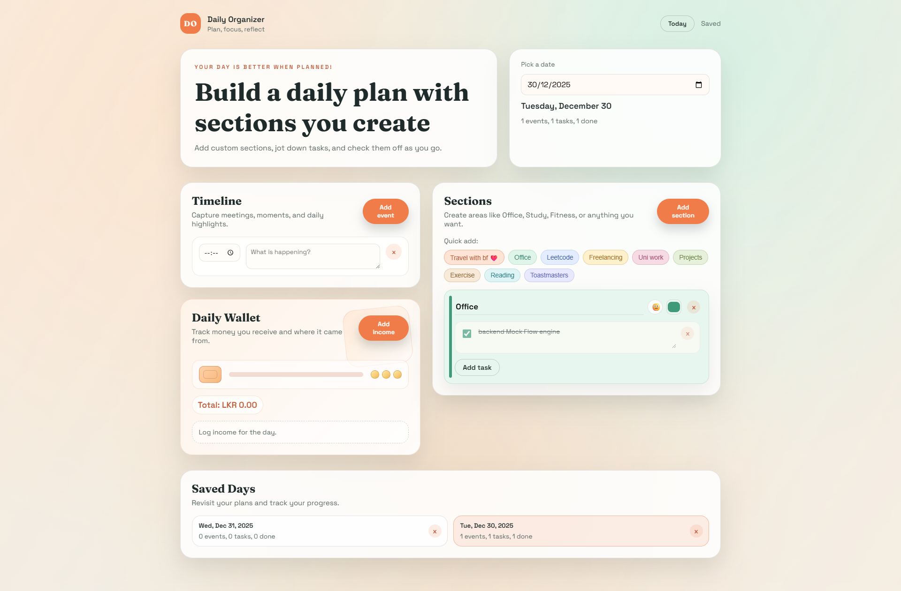
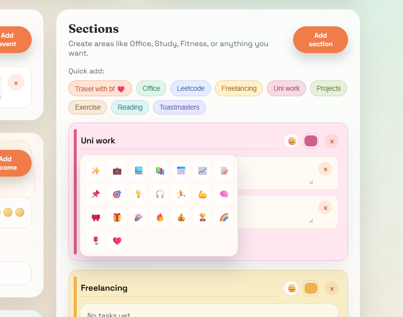
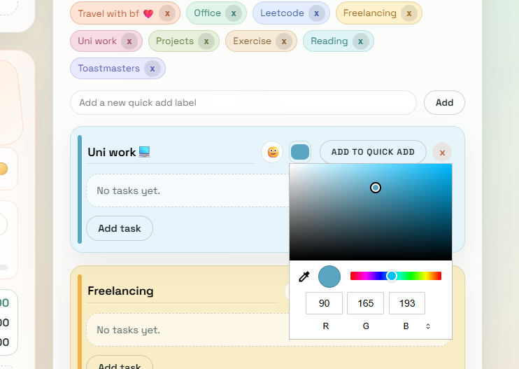
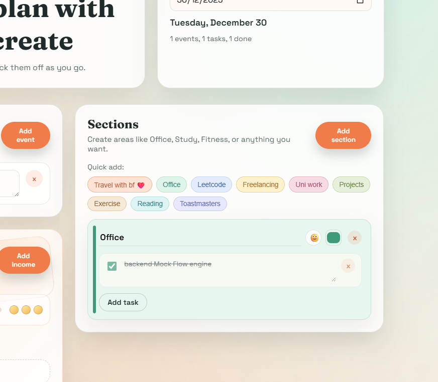
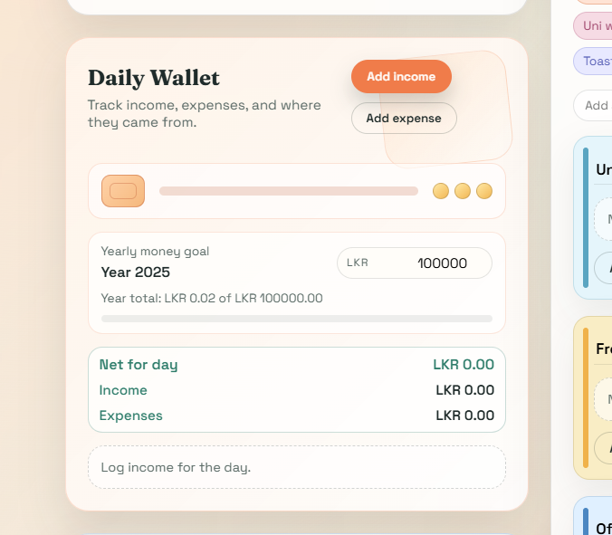

# Daily Organizer

Daily Organizer is a warm, website-like daily planner for building a day that feels intentional. Create
custom sections, add tasks, celebrate achievements, track income and expenses in a mini wallet,
set yearly money goals, note improvements to focus on, and save every day for easy look-back.

## Highlights

- Custom sections with quick-add ideas, color picker, and emoji picker
- Task checkoffs with clean, focused layouts
- Timeline for daily events
- Daily Wallet with income/expense tracking, yearly goals, and net totals (LKR)
- Achievements board to celebrate wins with encouragement
- Improvements focus prompt for growth-oriented reflection
- Saved Days history with smooth delete confirmations
- All data stored locally in the browser

## Screenshots

## Getting Started

1. Open `index.html` in your browser.
2. Add sections, tasks, events, and wallet entries.
3. Pick dates to review previous days.

## Notes

- Data is stored in `localStorage` on the current device and browser.

Created by Manushi Chamika

This Repo is under MIT license
